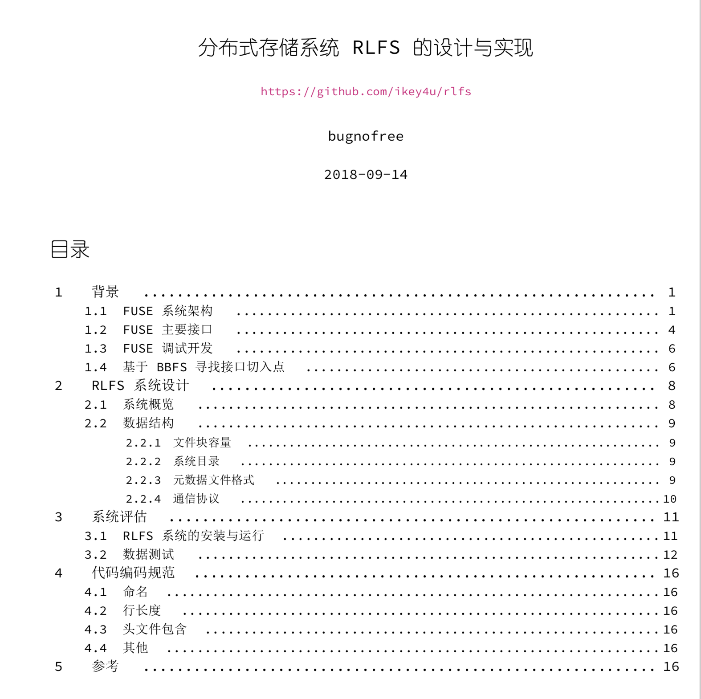

# RLFS

A parallel distributed cloud storage system based FUSE. You can save and retrieve your
files to and from storage nodes, in a parallel way.

## Details

The requirements could be found in the `rlfs.pdf` file.

The details could be found at `docs/out/main.pdf`. Here is an overview

I have no time to make an English document, sorry for that.

## Installation

For Ubuntu 16.04 x64 users, you may run `scripts/install-rlfs.sh` to install the RLFS
system without any pain. If you do have one ... well ...

The main source code could be found in the `src` directory. `rlfsc.c` and `rlfsd.c` are the
client and server, respectively.

## Acknowledges

Many thanks to [BBFS](https://www.cs.nmsu.edu/~pfeiffer/fuse-tutorial/) and
[Beej's Guide to Network Programming Using Internet Sockets](https://beej.us/guide/bgnet/).
